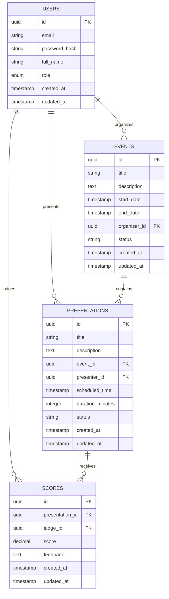

# Database Structure

This directory contains the database schema and seed data for the Showcase application.

## Schema Overview

### Users Table
- Stores user information with different roles (admin, event_organizer, judge, presenter, attendee)
- Uses UUID for primary keys
- Includes email, password hash, full name, and role
- Timestamps for creation and updates

### Events Table
- Stores event information
- Linked to organizer (user)
- Includes title, description, dates, and status
- Timestamps for creation and updates

### Presentations Table
- Stores presentation information
- Linked to events and presenters
- Includes title, description, scheduling info, and status
- Timestamps for creation and updates

### Scores Table
- Stores judges' scores for presentations
- Linked to presentations and judges
- Includes numerical score and feedback
- Unique constraint prevents multiple scores from same judge
- Timestamps for creation and updates

## Setup Instructions

1. Create a PostgreSQL database:
```sql
CREATE DATABASE showcase_db;
```

2. Run the migrations:
```bash
psql -d showcase_db -f migrations/001_initial_schema.sql
```

3. (Optional) Load seed data:
```bash
psql -d showcase_db -f seeds/001_initial_data.sql
```

## Test Users

The seed data includes the following test users:

| Email | Password | Role |
|-------|----------|------|
| admin@showcase.com | admin123 | Admin |
| organizer@showcase.com | organizer123 | Event Organizer |
| judge@showcase.com | judge123 | Judge |
| presenter@showcase.com | presenter123 | Presenter |
| attendee@showcase.com | attendee123 | Attendee |

## Database Diagram

